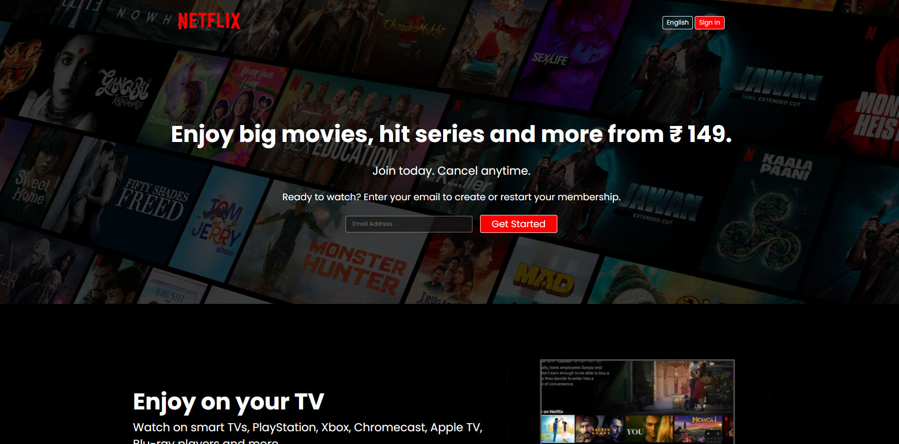

# 🎬 Netflix Clone – Responsive Frontend UI Project

## 📌 Project Overview

This project is a fully responsive **Netflix landing page clone** built using **HTML and CSS**.

It replicates the core user interface of Netflix, including hero section, feature sections, FAQ layout, and responsive design behavior across devices.

The main goal of this project was to strengthen frontend development skills and understand modern website layout structure.

> ⚠ This project is created for educational purposes only and is not affiliated with Netflix.

---

## 🚀 Live Demo

🔗 https://mayuresh-2601.github.io/Netflix-Clone/

---

## 🎯 Key Features

✔ Responsive Landing Page
✔ Modern UI Layout
✔ Hero Section with Email Input
✔ Multiple Content Sections
✔ FAQ Section Layout
✔ Footer Navigation
✔ Clean Design
✔ Mobile Responsive Layout (Media Queries)

---

## 🛠️ Technologies Used

* HTML5
* CSS3
* Flexbox
* Grid
* Responsive Design
* GitHub Pages

---

## 📂 Project Structure

Netflix-Clone/
│
├── index.html
├── style.css
└── assets/
└── images/

---

## 📊 UI & UX Highlights

* Clean and modern Netflix-inspired layout
* Structured content sections
* Responsive design for mobile devices
* Consistent typography and spacing
* Simple and user-friendly interface

---

## 📈 What I Learned

* Building responsive layouts using HTML and CSS
* Using Flexbox and Grid for layout design
* Creating real-world UI clones
* Writing clean and organized code
* Using Git and GitHub for version control
* Deploying projects using GitHub Pages

---

## 🚀 How to Run This Project Locally

1. Clone this repository:

git clone https://github.com/mayuresh-2601/Netflix-Clone.git

2. Open the project folder

3. Open:

index.html

in your browser

No installation required.

---

## 👨‍💻 Author

**Mayureshkaar**
Frontend Developer | Web Development Learner

GitHub:
https://github.com/mayuresh-2601

---

## ⭐ Support

If you like this project, consider giving it a ⭐ on GitHub!
